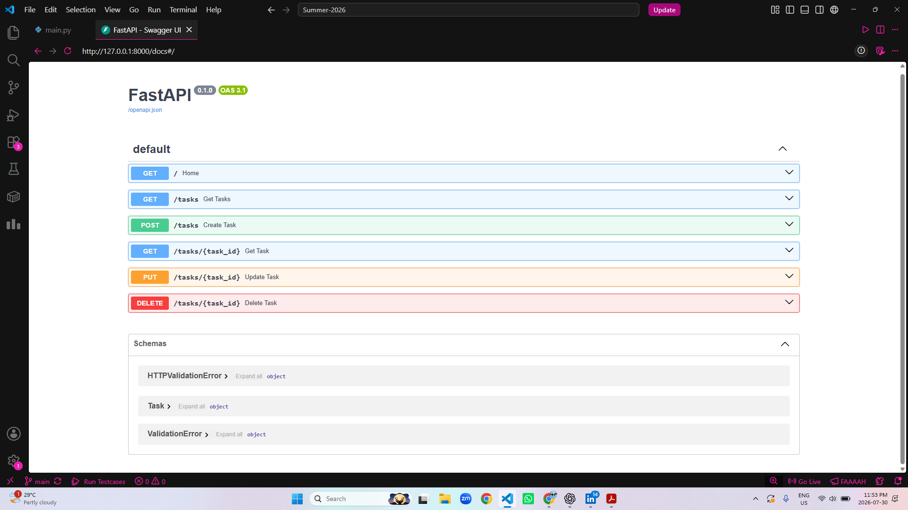

# Task API

A simple RESTful CRUD API built with FastAPI. This project allows users to create, read, update, and delete tasks using standard HTTP methods.

## Features

- Create a new task
- View all tasks
- View a task by ID
- Update an existing task
- Delete a task
- Interactive API documentation with Swagger UI

## Installation

1. Clone the repository:
   ```bash
git clone https://github.com/marium-faheem/Summer-2026.git
cd Summer-2026
cd "Backend Engineering"
```

2. Install the required packages:
   ```bash
   pip install fastapi uvicorn
   ```

## Run the API

Run the following command:

```bash
uvicorn main:app --reload
```

Then open:

- API: http://127.0.0.1:8000
- Swagger UI: http://127.0.0.1:8000/docs

## API Endpoints

| Method | Endpoint | Description |
|--------|----------|-------------|
| GET | `/` | Home endpoint |
| GET | `/tasks` | Get all tasks |
| GET | `/tasks/{task_id}` | Get a task by ID |
| POST | `/tasks` | Create a new task |
| PUT | `/tasks/{task_id}` | Update a task |
| DELETE | `/tasks/{task_id}` | Delete a task |

## Example `curl -i` Output

Command:

```bash
curl -i http://127.0.0.1:8000/tasks
```

Example output:

```http
HTTP/1.1 200 OK
content-type: application/json

[
  {
    "id": 1,
    "title": "Learn FastAPI",
    "completed": false
  }
]
```

## Swagger UI

The API includes interactive documentation powered by Swagger UI.



